<h1 align="center">Hi , I'm Techin</h1>

  

 

  <table border="0" cellpadding="0" cellspacing="0">
    <tr>
      <td valign="top" align="center" width="48%">
        
      </td>
      <td valign="top" align="center" width="48%">
        
      </td>
    </tr>
  </table>

 

## About My Approach

I believe in automating everything and building scalable, reliable systems. My approach focuses on bridging the gap between development and operations through robust CI/CD pipelines and infrastructure as code, primarily leveraging cloud platforms like AWS.

**CI/CD & Deployment Automation**: Automating the software development lifecycle. I design and implement pipelines that enforce quality checks and streamline deployments, ensuring fast and reliable software delivery.
**Cloud Infrastructure**: Utilizing cloud services (like **AWS**) to build scalable and highly available environments.
**Infrastructure as Code (IaC) & Containers**: Managing and provisioning infrastructure through code (**Terraform**) and containerizing/orchestrating services (**Docker**, **Kubernetes**) for reproducible environments.

 

## Activity

  

 

## Languages

  

 

## Commit Calendar

  

 

## Coding Habits

  

 

## Achievements

  

